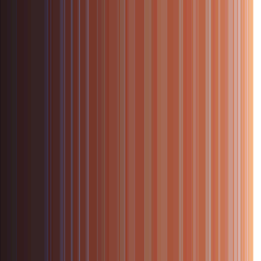

# Lines
Simple software to change a representation of the input image from the 2D pixel grid to blocks composed of vertical lines. The thickness of each block is determined from the number of pixels with respective colours.

  
  &nbsp;&nbsp;
   
  <em>Lena on the left is transformed to the image on the right.</em>

It is currently hardcoded to use a file `lena.png` but the algorithm works for any input.

